# Frappe Operator UI

Kubernetes UIs for the [Frappe Operator](https://github.com/vyogotech/frappe-operator).

Today this repo holds the **OpenShift Console dynamic plugin**, which also runs
standalone on vanilla Kubernetes. A Headlamp plugin is planned.

The plugin renders the operator's CRDs as Frappe concepts rather than raw YAML.
A bench is a fleet with a database and Redis behind it; a site is a tenant with
migrations, app installs, backups and restores in its history. It registers its
own navigation section, so none of this is reached through *Custom Resource
Definitions*.

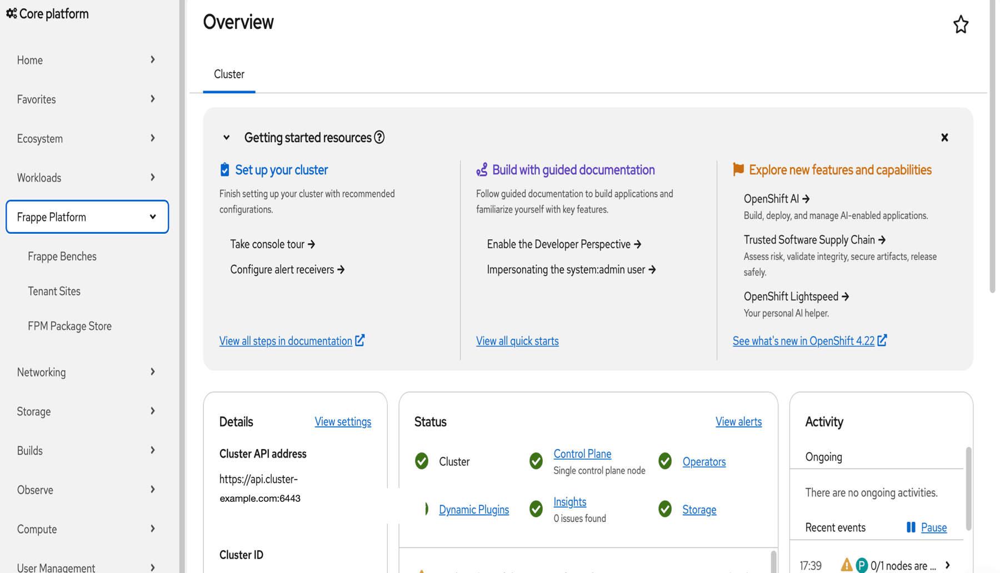

## Benches

The **Frappe Benches** list resolves the things you would otherwise have to open
the YAML to learn: which Frappe version the bench pins, which apps are on it,
whether its database and Redis are operator-managed or attached to something
external, and how many tenant sites reference it.

`Create Bench` splits into *With Form* and *With YAML* — the form is the plugin's
own, the YAML route hands off to the console's editor.

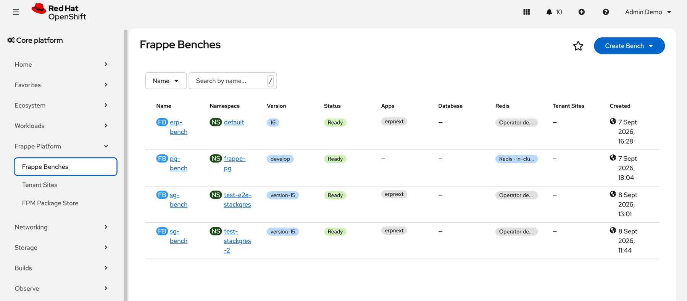

A bench's details page keeps the console's own **Details** and **YAML** tabs and
adds four:

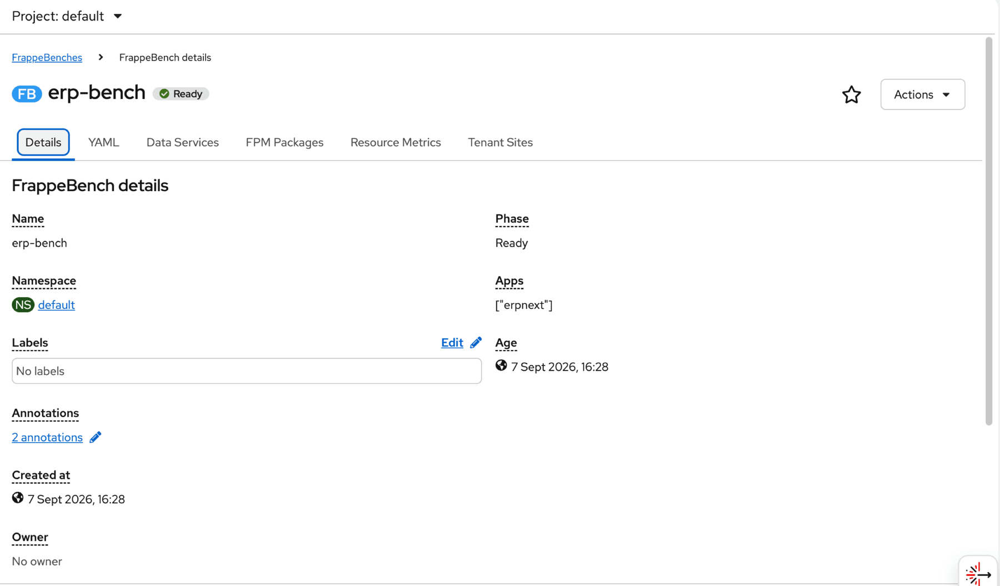

**Data Services** reads `spec.dbConfig` and `spec.redisConfig` and says what the
bench actually defaults to — provider, shared vs dedicated mode, an attached
MariaDB/PostgreSQL CR or an out-of-cluster host — then lists the sites that
override it.

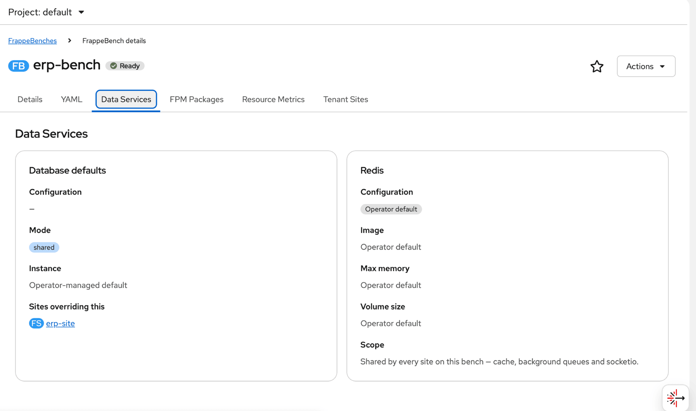

**Resource Metrics** runs PromQL through the console's `QueryBrowser` and
`usePrometheusPoll`, summed by pod, for the workloads belonging to that bench.
This tab needs the cluster monitoring stack and is console-only.

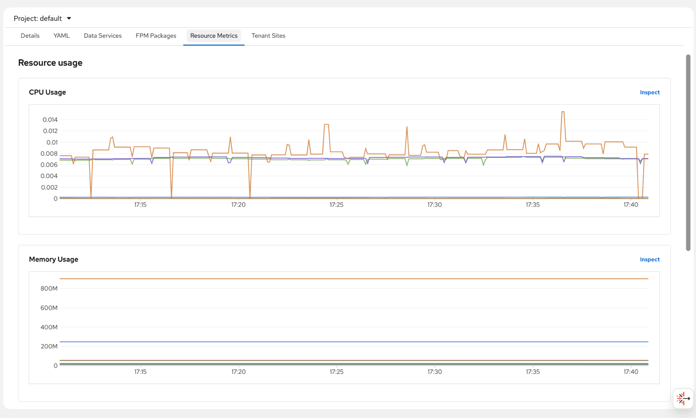

**Tenant Sites** lists the sites whose `benchRef` points at this bench, with a
`Create Site` button already scoped to it. **FPM Packages** pairs the bench's
configured FPM repositories with the applications installed from them.

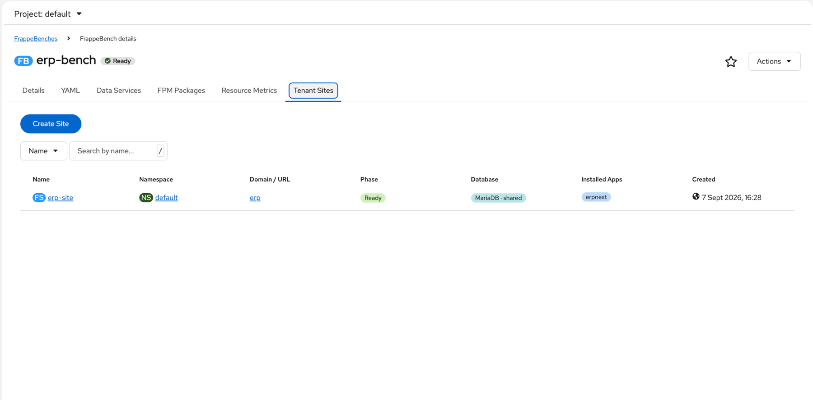

## Sites

The **Tenant Sites** directory is the fleet-wide view: every site, its parent
bench, its resolved URL, which database backs it and whether a route exists.

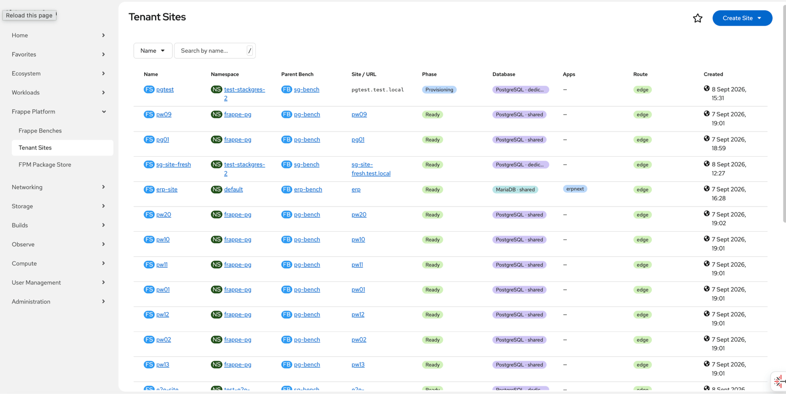

A site's details page adds **Database & Redis** and **Operations**.

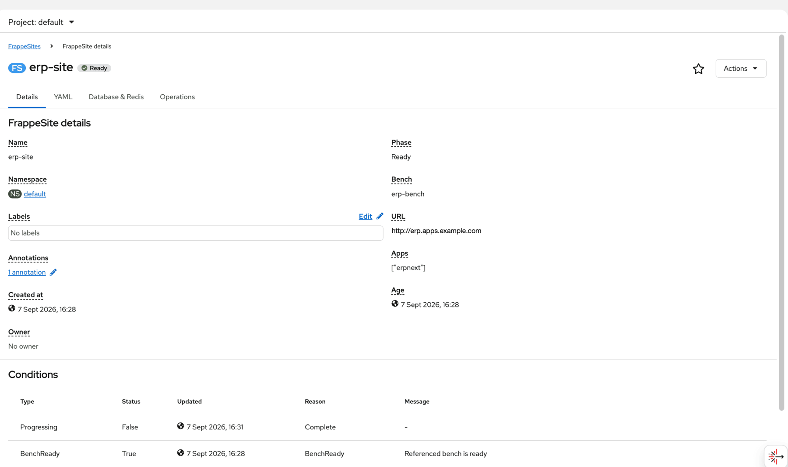

**Operations** is the reason the tab exists: `SiteMigration`, `SiteApp`,
`SiteBackup` and `SiteRestore` are separate cluster-scoped lists in a stock
console, so seeing what has happened to *one* tenant means filtering four
different pages. The tab gathers them into four cards, newest first, each with
the button that creates the next one.

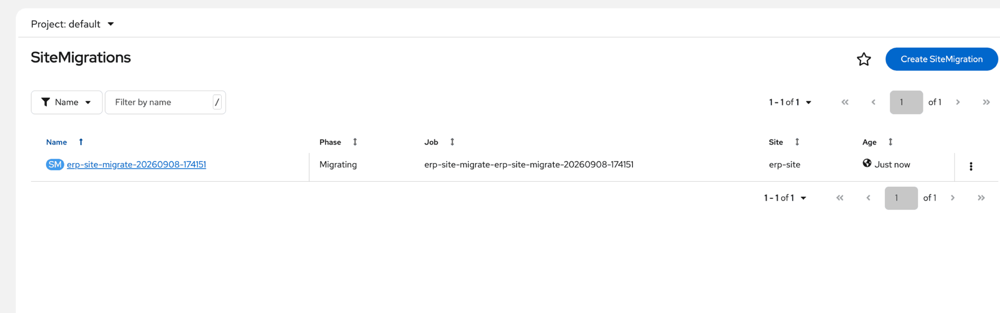

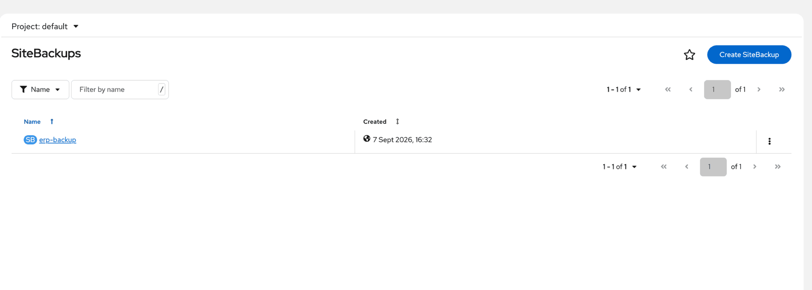

## Actions

Every action opens a modal, creates the corresponding CR, and navigates to it —
nothing is executed from the browser.

| Action | Resource | Creates | Notes |
|---|---|---|---|
| Open site | FrappeSite | — | Disabled until the operator resolves `status.siteURL` |
| Migrate site | FrappeSite | `SiteMigration` | Optional pre-migration backup |
| Install app | FrappeSite | `SiteApp` | FPM package or Git repository |
| Back up site | FrappeSite | `SiteBackup` | One-off, or a recurring schedule |
| Restore site | FrappeSite | `SiteRestore` | Replaces the site database from a backup |
| Re-run site initialization | FrappeSite | patches the `FrappeSite` | Disabled while the site is Ready — for retrying a failed provision |
| Create site | FrappeBench | `FrappeSite` (via form) | |
| Migrate all sites | FrappeBench | one `SiteMigration` per site | Disabled when no site references the bench |

Each action carries an `accessReview`, so the console greys out what RBAC forbids
instead of letting a user fill in a form the API server will reject on submit.

The operation actions stay enabled while a site is still provisioning: the
operator accepts the CR and holds it Pending until the site reports Ready, which
is more useful than refusing the click.

**Install app** takes either source. FPM resolves a prebuilt package with
compiled assets and vendored wheels, so nothing is built on the bench — this is
the path that works air-gapped:

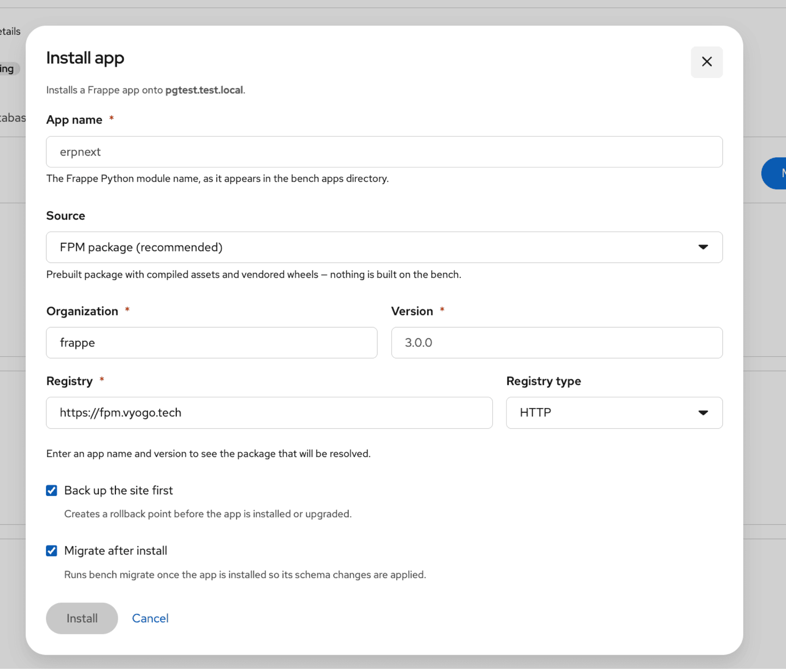

Git clones and builds at install time, and needs Git egress from the cluster:

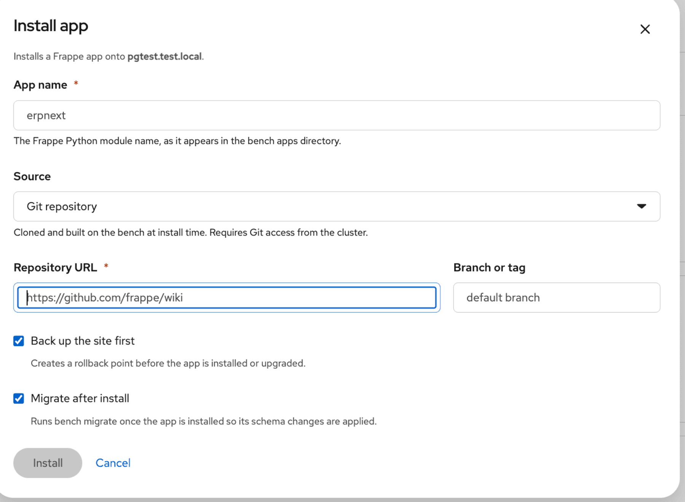

## FPM Package Store

A cluster-wide page with two tabs: **Configured Repositories**, aggregated from
every bench's `spec.fpmConfig.repositories` with priority, scope and auth secret;
and **Site Applications**, every `SiteApp` in the cluster with its resolved
package, phase and installed version.

## Requirements

- The **Frappe Operator** installed, with its CRDs in `vyogo.tech/v1`:
  `FrappeBench`, `FrappeSite`, `SiteMigration`, `SiteBackup`, `SiteRestore`,
  `SiteApp`.
- For plugin mode, an OpenShift console on the **4.19+** SDK line (PatternFly 6).
- For the Resource Metrics tab, the cluster monitoring stack.

## RBAC

The actions depend on the aggregated `edit`/`view` ClusterRoles, which ship with
the **operator** (`config/rbac/`), not with this repo. Without them only
cluster-admins can create a `SiteMigration`, and every action renders greyed out.

## Modes

| Mode | Entry point | Notes |
|---|---|---|
| OpenShift dynamic plugin | `src/index.tsx` | Consumes the console's PatternFly 6 via module federation |
| Standalone | `src/StandaloneApp.tsx` | Ships its own PatternFly; for vanilla Kubernetes |

The plugin deliberately does **not** bundle PatternFly in console mode — the SDK
aliases every `@patternfly/react-styles` stylesheet to `false`, so a plugin must
share the console's major version. This tracks PatternFly 6 on the 4.19 SDK line.

## Develop

```sh
npm ci
npm run typecheck     # tsc --noEmit; webpack uses transpileOnly and hides type errors
npm run lint
npm run build
npm start             # dev server on :9001, CORS open for the console
```

To load the dev server into a running console, run the console container with
`-e BRIDGE_PLUGINS="frappe-console-plugin=http://localhost:9001"`.

## Deploy

```sh
docker build -t <registry>/frappe-console-plugin:<tag> .
# update deploy/deployment.yaml with your image, then:
kubectl apply -f deploy/
```

The manifests target the `frappe-operator-system` namespace. The container
serves HTTP on 8080 and HTTPS on 9443; `entrypoint.sh` picks the nginx config at
startup based on whether an OpenShift serving certificate is mounted at
`/var/serving-cert`, so the same image works on both platforms.

`deploy/consoleplugin.yaml` registers the plugin as *Frappe & ERPNext Platform*.
Registering it is not the same as enabling it — the console operator also has to
be told to load it:

```sh
oc patch consoles.operator.openshift.io cluster --type=json \
  -p '[{"op":"add","path":"/spec/plugins/-","value":"frappe-console-plugin"}]'
```

If no plugin is enabled on the cluster yet, `/spec/plugins` does not exist and
that patch fails; use `{"op":"add","path":"/spec/plugins","value":["frappe-console-plugin"]}`
instead.

On vanilla Kubernetes apply everything except `consoleplugin.yaml`, and edit the
host in `deploy/ingress.yaml`.

## Layout

```
src/frappe/          CRD contract — types, models, shared accessors
src/components/      List pages, detail tabs, and the create forms
src/components/modals/   One modal per operation CR
src/actions/         Console Actions-menu providers for both kinds
console-extensions.json  Nav, routes, tabs and action providers
deploy/              Deployment, Service, Ingress, ConsolePlugin
assets/screenshots/  The images above
```

## License

Elastic License 2.0. See [LICENSE](LICENSE).
